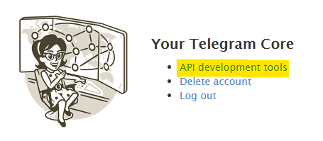
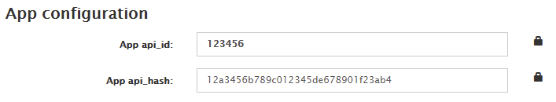
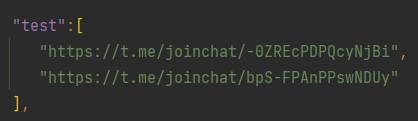
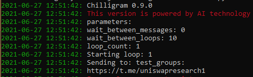

# 1. Install python
  
First you need to install python 3 from the Windows Store:

https://www.microsoft.com/en-us/p/python-39/9p7qfqmjrfp7

After Python was installed, you can confirm it's working correctly by opening up a command prompt (cmd)
and executing '_python_'. If it was installed correctly, the output should look something like this:

## Troubleshooting:

If the result of the output is as follows, it means that python isn't working as intended:

`'python' is not recognized as an internal or external command`

🤷‍

# 2. Install requirements 
Simply run the file `install_requirements.bat` to install the necessary requirements.

If Python was installed during the previous step, this process should execute flawlessly

# 3. Get your Telegram API access
Chilligram will use your own Telegram account to shill on your behalf. Therefore you need to grant Chilligram access to your Telegram account.

Unlike regular clients, bots use API to access your account.
To request your own personal API access, open  https://my.telegram.org and login.

Once logged in, navigate to the 'API development tools' section

Once there, create a new App. The data you input doesn't matter (You can call the App 'Chilligram' if you like or just fill in any bogus information)
After you've created the App, we need the retrieve the `api_id` and `api_hash`.

These act as your username/password. Please don't share them with anyone.

_Disclaimar_ : 
- You can continue to use your Telegram at anytime, even while Chilligram is running
- Chilligram will never use your credentials other than to shill in the groups you've specified in the config-file
- At no point will Chilligram send out this data to anyone
  - Please do not share this data with the Chilligram team either
- You can revoke this access at any time on the _my.telegram.org_ website

# 4. Setup Chilligram

Now that all the requirements have been met, we can start configuring Chilligram

First, copy/rename the file `config.ini.example` to `config.ini`

Open the file with a text-editor and set the following lines accordingly:

In the `[telegram]` section, please simply fill in your api_id and api_hash you've retrieved from Telegram in the previous step.

The rest of this section will explain the various different lines in the `[settings]` section:

### enable_test_mode
Please set this to `True` until you've confirmed that Chilligram is working as intended. This setting will only send messages to certain test groups (These correspond with the `"test"` section in the `groups.json`)
Setting this option to `False` will enable Live-mode.

Again: We **strongly** recommend that you're 100% certain what you're doing before setting this to False

_default: True_

### test_mode_messsage_type
This setting can have 4 valid values: `strict`, `tolerant`, `nocontract`, `image`
Depending on which setting is set, Chilligram will either send your strict-message, your tolerant-message,... to the test groups
It's recommended to test out each output message once before to make sure that they're all working as intended.

_default: strict_

### wait_between_messages
Each time Chilligram sends a message to a group, it will wait this many seconds before it continues sending the next message.

It's recommend to set this value higher than 0 to prevent bans. 

_default: 5_

### wait_between_loops
After Chilligram has send a message to every group in the enabled groups-lists, it will wait this many seconds until it starts anew again.
In other words, this is the wait-time before Chilligram sends another message into the same group. Groups tend to ban you for sending too many messages in a short time-period.

There is no recommended value for this setting. Some groups tend to ban users for sending a message every 5  minutes, while others are more lenient

_default: 300_ (= 5 minutes)

### loop_count
The number of times Chilligram will loop until it stops working.
Settings this value to 0 will loop infinitely

_default: 1_

### image_path
The path for the image-file that will be used to send image messages.
Chilligram will send this image as an attachment and add the 'tolerant' text along with it.

Please, make sure that the file is in the same directory as Chilligram and that you've typed in the filename (+extension) correctly.
If you do not have a shill-image or do not wish to use shill-messages with an image, turn off the image-messages (see below)

### enable_XXXX_messages
The following settings will allow you to turn on/off a specific message-type completely. If turned off, Chilligram will ignore the entire list of groups that corresponds with that message type

For example, setting `enable_strict_messages = True` will send the 'strict_message' to the `"strict"` groups in the `groups.json`

_default: False_

## Troubleshoot:

If any of the settings don't behave as intended, you most-likely set an invalid value. The most common mistake is using the wrong case.
All settings are case-sensitive: True (not true), False (not false), strict (not Strict), etc.

# 5. First test run
Before the first launch, we'll need to inspect the `groups.json`, which is the most important  part of Chilligram.
This file contains a list of all the different groups Chilligram is going to send messages in.
This is a JSON file, so please use the correct formatting to edit it. Even a small mistake in this file will stop Chilligram from starting again.

The file contains various group categories ("strict", "nocontract", "tolerant", "image"), followed a colon and square-brackets. The square-brackets contain the actual groups, separated by commas.
Please note that there is no comma after the final entry (see image above).

For now, we want to focus on the "test" category, which contains 3 different private groups.
You should join both of these chatrooms manually before proceeding.

Once you've entered the test groups and set all the necessary settings in the previous step (`enable_test_mode` should be set to `True` during your first run) open the `Chilligram.bat` file.
Chilligram will now ask you for your Telegram login data. This is an additional method of security.

After the first launch, Chilligram will create a new file called `default.session`, which will contain your session files.
Subsequent launches will automatically remember your credentials. If you delete this file, you'll need to retype your credentials again.

The console window should look similar to this:

Chilligram will display the version number you're running (for debugging purposes) and then display the main settings from the config.ini. Please confirm that these values are correct. It's recommended to set the `loop_count` to 1 on your first few runs.

After that, Chilligram should already start working. Now just open up the two test-groups manually and confirm that your message has been sent out successfully.

The test groups service different purposes.
- No restrictions apply to the "Normal" group. This group can be used to spam at any frequency.
- The "Slow" group has enabled slow mode for 15 minutes. Use this to test how Chilligram behaves for being soft-banned. 
- The "Mute group is a group where users don't have permissions to send out any messages. Use this to test how Chilligram behaves in groups where writing isn't permitted.

If you've changed any of the settings, please restart Chilligram for the settings to take effect.

# 6. Switching from test_mode to live
After you've tested Chilligram a few times in test_mode and are happy with the results, you can finally switch on live mode by setting:
`test_mode = False`

Make sure you've joined the pre-defined groups in the groups.json or add your own groups to that list
- We do not recommend setting wait_between_messages lower than 1
- We do not recommend setting wait_between_loops lower than 300
- We do not recommend shilling in public groups with @Combot
  
Not using Chilligram responsibly will lead to local or global bans

# FAQ:
Q: How does Chilligram work?  
A: Chilligram uses your Telegram account to continuously write messages on your behalf in any group of your choosing

Q: How many messages can Chilligram send?  
A: Technically there is no limit on how much and how often Chilligram can send out messages. However, normal bans can occur if you use it irresponsibly. We recommend not sending more than 1 message per second and not posting in the same group more often than every 5 minutes.  

Q: How do I change the groups Chilligram shills in?  
A: Simply open the groups.json and look at the different pre-defined categories: strict, tolerant, nocontract, image.  
Before you add a new group to this list, please make sure what type of content is allowed in this group. Then add it accordingly to the category it applies to (see next question) 

Q: What's the significance of the different shill message types / shill groups?  
A: Different groups have different types of message-restrictions. To shill your project in the most effective way possible, Chilligram let's you define 4 different types of shill-messages to get the best possible outcome:
- "strict" groups only allow a rather short message to be sent. These groups also prohibit links of any kind.  
- "tolerant" groups allow a rather long shill message to be sent. There is usually little content-restrictions. These messages can contain many characters and links
- "image" groups are similar to tolerant-groups, but they even allow for image attachments. Chilligram will use an image (provided by you) along-side the tolerant-message to shill in these groups
- "nocontract" groups do not allow the inclusion of a contract address in the shill message. It's also recommended to not use any links in these groups.

Q: How do I change the Chilligram shill-messages?    
A: When you first acquire Chilligram, you'll be asked to provide several shill-messages. Chilligram is meant to be used for a single project only. Only the Chilligram team can change these messages for you. If you've provided us with a shill-messages containing typos or would generally alter your initial message, please contact the support.

Q: I've set the wait_between_messages to X - why is the time in between messages higher than that?    
A: To make Chilligram as reliable as possible, the Bot always awaits the message confirmation for every message it sends out. Only after that will Chilligram send another message. Internet delays and Telegram lags will cause this time to increase. Chilligram only makes sure there is a minimum delay in between messages to prevent bans. 

Q: I purchased Chilligram for my project. Can the other project-members use Chilligram for free?
A: Yes. You can send out the Chilligram files that were provided to you. Please keep in mind that we don't have the capacity to provide support to each of your project-members.
  
Q: Can I switch my license model after my initial purchase?  
A: Yes, please contact us, so we can work out a fair solution for you.

Q: I purchased Chilligram, but I can't get it to work  
A: Please follow the manual instructions step-by-step. If you're stuck at any certain point, please provide us with **the current step in the manual** you're stuck at

Q: I've used Chilligram, but I've been banned  
A: Chilligram has a number of features to prevent you from getting banned.
But ultimately, there is no guaranteed way to avoid bans.
Out of the box, Chilligram uses conservative settings to prevent any types of bans.
If you've change the Chilligram settings beyond the recommended values, it's your fault.  
Use Chilligram responsibly:
- Do not shill in the same group too often
- Don't flood
- Choose your shill-messages carefully (Our staff will try to advise you on this)
- Avoid @Combot moderated groups
- Most importantly: Don't shill in groups where shilling is forbidden

